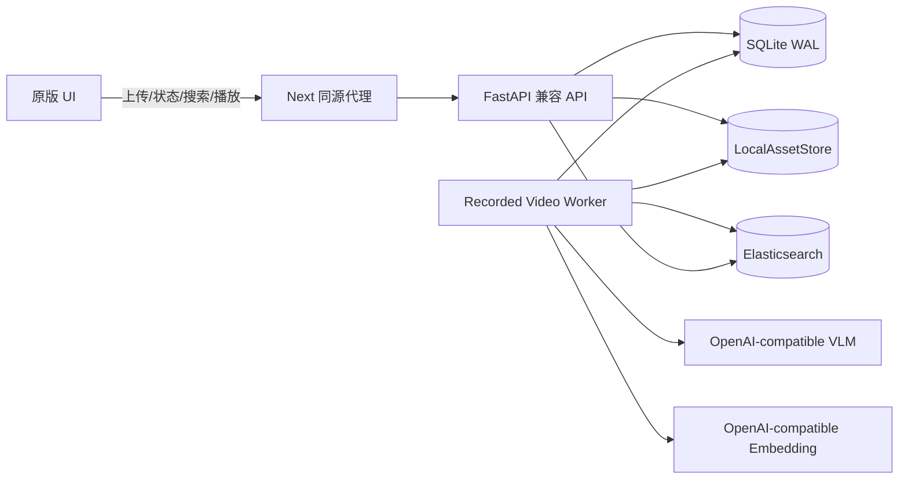
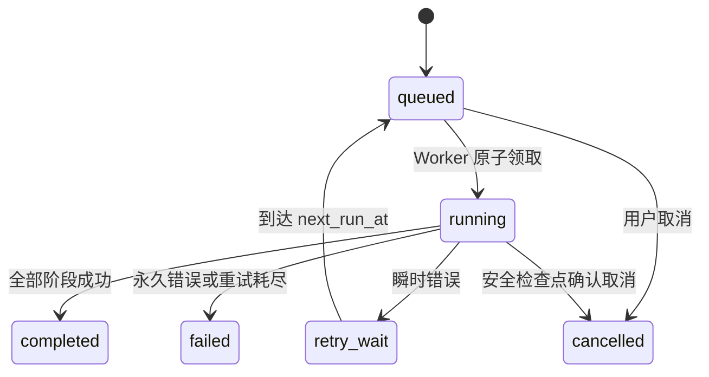

# 真实录播视频生产闭环设计

日期：2026-07-12

OpenSpec change：`production-recorded-video-ingest`

状态：已完成方案确认，等待文档审阅

## 1. 背景

当前项目已经证明下面这条快速验证链路成立：

```text
预制 metadata + deterministic mock vector
  -> /api/search/ingest
  -> Elasticsearch
  -> /api/v1/search
  -> SearchAgent / embed_search
  -> 原版 UI 展示
```

这条链路验证了 ES 和原版 UI 的搜索契约，但没有走真实录播业务：用户没有上传视频，系统没有分析视频，搜索向量不来自真实模型，搜索结果也没有可靠的视频资产、缩略图和时间段播放来源。

原版 NVIDIA VSS 的录播链路依赖 VST、RTVI/Cosmos 等服务。本项目的目标是移除 NVIDIA 必需运行依赖，因此不能通过重新引入这些服务来获得“生产真实性”。本设计保留原版 UI 和有价值的业务契约，使用开放且可替换的本地实现完成真实闭环。

## 2. 已确认范围

第一阶段交付下面的录播闭环：

```text
原版 UI 上传真实 MP4/MKV
  -> 本地持久化
  -> 可恢复异步任务
  -> 固定时间分段
  -> 代表帧与真实 VLM 描述
  -> 真实 embedding
  -> Elasticsearch segment 索引
  -> 原版 UI 搜索、缩略图和时间段播放
```

运行规模为准生产单机：

- 同时处理 2-5 个上传或分析任务。
- 单文件最大约 10 GB，限制可配置。
- 任务状态持久化，服务重启后可恢复或重试。
- 视频和派生文件使用本地文件系统。
- VLM 与 embedding 使用 OpenAI-compatible API。
- 固定时间分段作为首个实现，但必须能替换为场景或事件算法。
- 后端适配原版 UI 契约，前端只做异步状态所需的最小调整。

明确不做：RTSP、告警、Kafka/MDX、多租户、多节点、完整 VST 复刻、MinIO/S3、Redis/Celery、本地模型和场景检测分段。

## 3. 设计原则

1. 先跑通真实业务，不用 mock 冒充生产能力。
2. 首期的实现可以是单机的，但业务接口不能绑定 SQLite 或本地路径。
3. API 不执行耗时模型任务，避免上传或搜索请求拖垮服务。
4. SQLite 是业务状态事实源，ES 是可重建检索投影。
5. 半成品不能进入搜索结果。
6. 每个重试、崩溃恢复和删除操作必须幂等。
7. 不引入与 NVIDIA 去依赖目标无关的常驻服务。
8. 运行时默认只监听 loopback，不依赖 sudo 或系统级安装。

## 4. 总体架构



单脚本启动五个运行单元：Elasticsearch、FastAPI、Worker、原版 UI 和日志汇聚器。API 与 Worker 使用同一份解析后的配置和同一个 SQLite，但职责分离。

## 5. 模块边界

### 5.1 API 进程

API 只处理可在短时间内完成的工作：

- 创建上传会话。
- 接收并持久化单个 10 MB chunk。
- 原子合并完整文件。
- 创建、查询、重试或取消任务。
- 列出和删除资产。
- 提供缩略图和支持 HTTP Range 的媒体响应。
- 提供原版 VST 读取 facade 和现有 `/api/v1/search`。

API 不调用 VLM、不生成 embedding、不执行整段视频处理。

### 5.2 Worker 进程

Worker 负责领取和执行耗时任务：

```text
probe -> segment -> extract -> analyze -> embed -> index -> publish
```

Worker 使用有限并发槽位，外部模型调用还需要独立的 provider 并发限制。进程收到停止信号后停止领取新任务，在安全检查点结束当前步骤并释放或等待租约过期。

### 5.3 可替换端口

| 接口 | 首期实现 | 后续替换方向 |
|---|---|---|
| `AssetStore` | 本地文件系统 | MinIO/S3 |
| `JobRepository` | SQLite WAL | PostgreSQL、Redis/Celery |
| `Segmenter` | 固定时间 | 场景检测、事件算法 |
| `VisionProvider` | OpenAI-compatible | 本地或其他兼容服务 |
| `EmbeddingProvider` | OpenAI-compatible | 本地或其他兼容服务 |

业务流水线依赖这些接口，不读取实现特有的物理路径或数据库连接。

## 6. 原版 UI 兼容协议

### 6.1 三段式上传

1. `POST /api/v1/videos`，请求 `{filename}`，返回同源 `url` 和上传会话。
2. 原版 UI 沿用 `nvstreamer-*` headers，将文件按 10 MB 分块 POST 到返回 URL。
3. 最后一块返回 `sensorId`；UI 调用 `POST /api/v1/videos/{sensorId}/complete`。

`sensorId`、`streamId` 和本项目 `asset_id` 使用同一个稳定 UUID。Chat 上传通过步骤 1 创建会话；Video Management 直接调用 VST upload URL 时，后端可根据 `nvstreamer-identifier` 懒创建会话。

完成回调返回：

```json
{
  "asset_id": "uuid",
  "job_id": "uuid",
  "status": "queued",
  "status_url": "/api/v1/jobs/uuid"
}
```

重复 complete 返回同一 asset/pipeline version 对应的任务。

### 6.2 异步状态

原版 UI 的上传进度保持不变。上传 100% 后进入 processing，轮询 `status_url`，直到 completed、failed 或 cancelled。只有 completed 才显示可搜索成功；failed 展示后端的安全错误摘要和重试入口。

### 6.3 VST 读取 facade

`NEXT_PUBLIC_VST_API_URL` 指向同源 `/api/v1/vst`。首期只实现原版录播页面实际调用的子集：

| 方法与路径 | 用途 |
|---|---|
| `POST /v1/storage/file` | nvstreamer 分块上传 |
| `GET /v1/replay/streams` | 录播视频列表 |
| `GET /v1/sensor/list` | Search 视频来源筛选 |
| `GET /v1/storage/size?timelines=true` | 存储和时间线摘要 |
| `GET /v1/storage/file/{asset}/url` | 返回时间段媒体 URL |
| `GET /v1/storage/file/{asset}` | 兼容直接媒体读取 |
| `GET /v1/replay/stream/{asset}/picture` | 返回片段缩略图 |

不实现 live stream、RTSP sensor 管理和告警接口。

## 7. 数据模型

### 7.1 `assets`

保存 asset ID、显示文件名、安全文件名、大小、SHA-256、MIME、源扩展名、时长、分辨率、timeline origin、状态、当前任务、创建/更新时间和软删除信息。

### 7.2 `upload_sessions`

保存 session ID、nvstreamer identifier、asset ID、总块数、已收块数、文件名、临时目录、状态和过期时间。唯一键保证同一 identifier 的重试不会创建第二份文件。

### 7.3 `jobs` 与 `job_steps`

`jobs` 保存业务状态、当前 stage、attempt、下次执行时间、lease owner、lease until、heartbeat、配置快照、最后错误和时间戳。`job_steps` 保存每个阶段的状态、输出 manifest/checksum、模型信息和耗时。

### 7.4 `segments`

保存稳定 segment ID、asset ID、pipeline version、序号、起止 offset、起止 ISO 时间、描述、缩略图 key、模型和 prompt 版本。大向量同时写派生 manifest 和 ES，SQLite 不承担向量检索。

## 8. 文件布局

```text
video-data/
├─ uploads/{session_id}/chunks/000001.part
├─ assets/{asset_id}/
│  ├─ source/original.ext
│  ├─ playback/proxy.mp4
│  └─ derived/{pipeline_version}/
│     ├─ manifest.json
│     ├─ embeddings.jsonl
│     └─ thumbnails/{segment_id}.jpg
└─ runtime/jobs.sqlite3
```

所有物理路径由 UUID 生成，不拼接用户文件名。文件先写 `.tmp`，完成 `fsync` 和校验后原子 rename。启动清理器只删除已过期且能从数据库证明无引用的临时目录。

## 9. 时间轴与媒体播放

上传参数中存在合法采集时间时，将其作为 timeline origin；否则使用上传完成时间 UTC。片段同时保存：

- `start_offset_ms` / `end_offset_ms`：真实媒体位置。
- `start_time` / `end_time`：原版 UI 展示和 VST 查询使用的 ISO 时间。

媒体 facade 把绝对时间转换回 offset。媒体响应支持 Range、`Accept-Ranges: bytes`、正确的 `Content-Range` 和 416。浏览器可直接播放的 MP4 使用原文件；MKV 或不兼容编码通过 ffmpeg 生成 proxy MP4。原文件始终保留。

## 10. 任务状态机



`running` 的 stage 为 probing、segmenting、extracting、analyzing、embedding、indexing。Worker 定期续租；进程退出后 lease 过期，任务可被重新领取。恢复时校验阶段 manifest 和 checksum，复用有效输出。

瞬时错误包括模型/ES 的 429、超时、网络错误和 5xx，默认退避 30 秒、2 分钟、10 分钟。永久错误包括损坏媒体、不支持格式、ffmpeg 缺失、配置缺失、无法校验的模型结构和 embedding 维度冲突。

## 11. 幂等与一致性

- chunk 唯一键：`session_id + chunk_number`。
- complete 唯一键：`asset_id + pipeline_version`。
- segment ID：`asset_id + pipeline_version + ordinal` 的确定性派生值。
- ES 文档 ID：与 segment ID 一致。
- 重试覆盖同一 ES 文档，不追加重复文档。
- 全部分析先写本地 manifest，完成后才 bulk 写 ES。
- ES 写入成功后，SQLite 单事务把 job 设为 completed、asset 设为 ready。
- 如果 ES 成功而 SQLite 提交前崩溃，恢复会以相同文档 ID 重放并完成对账。

## 12. Elasticsearch 契约

索引必须显式 bootstrap，启动时只校验，不动态猜测 mapping。主要字段：

| 字段 | 类型 |
|---|---|
| `asset_id`, `segment_id`, `sensor_id` | keyword |
| `source_type`, `pipeline_version`, `embedding_model` | keyword |
| `video_name` | keyword，并保留展示值 |
| `description` | text |
| `start_time`, `end_time` | date |
| `start_offset_ms`, `end_offset_ms` | long |
| `screenshot_url` | keyword，通常不索引 |
| `vector` | dense_vector，显式 dims，cosine |

模型或维度变化时创建版本化新索引，通过 alias 切换。禁止将不同维度写入旧索引。

生产 profile 中 query embedding、ES 或 mapping 失败必须返回受控错误。当前 deterministic mock 和内存 fallback 只允许在显式测试/smoke profile 中使用，不能写生产 alias。

## 13. 配置

建议增加独立配置块，示意如下：

```yaml
recorded_video:
  enabled: true
  data_root: /data/project/lyk/vsa-data
  max_upload_bytes: 10737418240
  allowed_extensions: [mp4, mkv]
  segment_duration_sec: 30
  representative_frames: 4
  worker_concurrency: 3
  lease_sec: 120
  max_attempts: 3
  upload_ttl_sec: 86400
  ffmpeg_path: ffmpeg
  ffprobe_path: ffprobe

search:
  enabled: true
  allow_mock_fallback: false
  force_mock_embedding: false
  embed_index_alias: vsa-video-embeddings
```

VLM 和 embedding 分别配置 model、base URL、API key 环境变量、timeout 和 concurrency。密钥不得写入临时 YAML、manifest、SQLite 配置快照或日志。

## 14. 单脚本启动

保留用户已经使用的入口：

```bash
./scripts/es-runtime-stack.sh \
  --api-port 8000 \
  --es-port 9200 \
  --ui-port 3000 \
  --index vsa-video-embeddings \
  --data-root /data/project/lyk/vsa-data \
  --conda-env vsa-agent
```

启动顺序：doctor、ES、索引校验、API、Worker heartbeat、UI、UI 到 API 的同源代理检查。任一必需组件失败则本次启动失败并输出对应日志路径。

doctor 检查 conda/Python 包、npm、Docker Compose、ffprobe/ffmpeg、数据目录权限、磁盘、模型配置、ES 客户端、mapping 和端口。端口只终止当前用户拥有的监听进程；其他用户进程导致清晰失败，不尝试 sudo。

默认启动不再运行会写生产索引的 ingest smoke。显式 `--validate` 使用独立验证索引或命名空间，并在验证后清理。

## 15. SSH 与同源代理

浏览器访问相对 `/api/v1` 和 `/api/v1/vst`。Next 代理必须流式转发 multipart chunk 和 Range 媒体，不能把 10 MB chunk 或视频完整缓冲到内存。服务器所有服务默认绑定 127.0.0.1。

客户端只需：

```bash
ssh -L 3000:127.0.0.1:3000 10.157.68.44
```

不需要开放服务器端口，也不需要浏览器直接访问 8000 或 9200。

## 16. 日志和可观测性

```text
.runtime/es-stack/runs/{run_id}/
├─ stack.log
├─ api.log
├─ worker.log
├─ ui.log
├─ es.log
└─ processes.json
.runtime/es-stack/latest -> 最近一次运行
```

终端用 `[stack] [api] [worker] [ui] [es]` 前缀汇聚。结构化日志至少包含 timestamp、level、event、run ID、request ID、asset ID、job ID、stage、attempt、duration 和 error code。禁止记录 API key、Authorization、原始视频字节和完整模型请求图像。

## 17. 删除和清理

ready/failed 资产可以删除。running 资产先请求取消，Worker 到安全检查点后进入删除。顺序为：ES 文档、派生文件、源文件、数据库软删除完成标记。每一步可重试；列表中不能出现无法追踪的“已消失但仍占磁盘”资产。

## 18. 测试策略

### 18.1 单元测试

覆盖配置、路径安全、状态迁移、错误分类、Segmenter、timeline 转换、manifest、mapping、Range 计算和幂等键。

### 18.2 组件测试

使用临时 SQLite/目录、真实 Elasticsearch 和本地假 OpenAI-compatible 服务，验证上传、Worker、ES 投影、搜索和媒体，不依赖外网模型。

### 18.3 故障测试

覆盖重复 chunk/complete、模型 429/5xx、ES bulk 部分失败、Worker 中断和租约恢复、磁盘不足、坏视频、取消及删除中断。

### 18.4 原版 UI E2E

Playwright 执行 MP4/MKV 上传、processing 状态、completed、搜索命中、缩略图、打开结果和 HTTP 206 播放。功能测试使用可控 provider；服务器验收再使用真实 OpenAI-compatible 模型评估语义质量。

## 19. 验收门槛

1. 同时提交三个真实视频，全部完成且 ES 无重复 segment 文档。
2. 处理中停止 Worker，重启同一脚本后从安全检查点恢复。
3. 模型先 429 后恢复时自动退避；坏视频明确失败且错误可查询。
4. 搜索返回正确视频和时间段，缩略图可见，媒体返回 206 并能播放。
5. 删除后 SQLite、ES、原视频和派生文件一致清理，重复删除幂等。
6. 默认启动不写 smoke 数据；显式验证不污染生产 alias。
7. 本地全量测试、前端测试、lint、OpenSpec strict validation和服务器真实链路验证全部通过。

## 20. 演进路线

阶段 1 完成上述真实闭环。阶段 2 加强断点续传、任务审计、指标、限流、死信处理和容量治理。阶段 3 通过既有端口替换为 MinIO/S3、PostgreSQL、Redis/Celery、场景 Segmenter 和横向 Worker，并增加多租户鉴权。升级不改变原版 UI 上传、任务、搜索和媒体业务契约。
